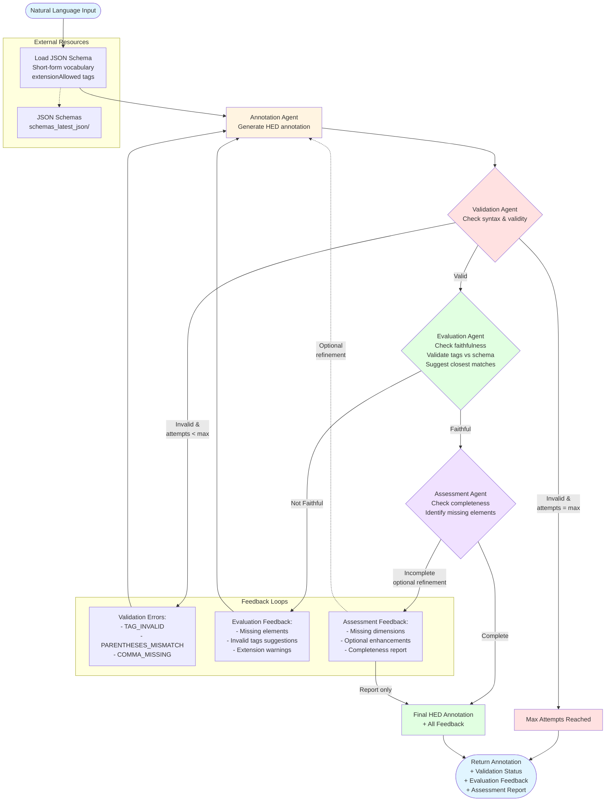

# HED-BOT

Multi-agent system for converting natural language event descriptions into valid HED (Hierarchical Event Descriptors) annotations.

## Features

- **Multi-Agent Architecture**: Uses LangGraph to orchestrate specialized agents
  - **Annotation Agent**: Generates HED tags using JSON schema vocabulary (short-form tags)
  - **Validation Agent**: Validates HED compliance with detailed error feedback
  - **Evaluation Agent**: Assesses faithfulness & suggests closest tag matches
  - **Assessment Agent**: Identifies missing elements & dimensions

- **JSON Schema Support**: Uses official HED JSON schemas with short-form tags and extensionAllowed detection
- **Intelligent Validation**: Multi-stage validation with feedback loops and closest match suggestions
- **Local LLM Serving**: Supports vLLM or Ollama for efficient multi-user inference
- **GPU Acceleration**: Optimized for NVIDIA RTX 4090 with CUDA support
- **Scalable**: Designed for 10-15 concurrent users

## Architecture



### Workflow Details

1. **Annotation Loop** (Automatic):
   - Generates HED annotation using short-form tags
   - Uses complete HED syntax rules (parentheses, curly braces, #, /)
   - Considers extensionAllowed tags for extensions
   - Maximum validation attempts: 5 (configurable)

2. **Validation Loop** (Automatic):
   - Checks syntax and tag validity
   - Provides specific error codes and messages
   - Loops back to annotation agent if errors found
   - Stops if max attempts reached

3. **Evaluation Loop** (Automatic):
   - Assesses faithfulness to original description
   - Validates tags against JSON schema vocabulary
   - Suggests closest matches for invalid tags
   - Warns about non-portable tag extensions
   - Loops back if not faithful

4. **Assessment Loop** (Optional):
   - Final completeness check
   - Identifies missing dimensions
   - Can trigger optional refinement or report only
   - Configurable behavior

## Installation

### Prerequisites
- Python 3.11+
- CUDA-capable GPU (for LLM serving)
- Node.js 18+ (for HED JavaScript validator)
- Conda (recommended)

### Setup

1. **Clone and navigate**:
```bash
cd /Users/yahya/Documents/git/HED/hed-bot
```

2. **Create conda environment**:
```bash
source ~/miniconda3/etc/profile.d/conda.sh
conda create -n hed-bot python=3.11 -y
conda activate hed-bot
```

3. **Install dependencies**:
```bash
pip install -e ".[dev]"
```

4. **Install HED JavaScript validator** (for validation):
```bash
cd /Users/yahya/Documents/git/HED/hed-javascript
npm install
npm run build
```

## Usage

### Start the Backend Server
```bash
uvicorn src.api.main:app --reload --host 0.0.0.0 --port 8000
```

### API Endpoints
- `POST /annotate`: Generate HED annotation from natural language
- `POST /validate`: Validate HED annotation
- `GET /health`: Health check

## Development

### Run Tests
```bash
pytest
```

### Code Quality
```bash
ruff check src/ tests/
ruff format src/ tests/
```

### Coverage Report
```bash
pytest --cov=src --cov-report=html
```

## Project Structure

```
hed-bot/
├── src/
│   ├── agents/         # LangGraph agent implementations
│   ├── validation/     # HED validation integration
│   ├── utils/          # Helper utilities
│   └── api/            # FastAPI backend
├── frontend/           # Web UI
├── tests/              # Test suite
├── docs/               # Documentation
└── plan.md            # Project roadmap
```

## License

MIT

## References

- [HED Standard](https://www.hedtags.org/)
- [HED Schemas](https://github.com/hed-standard/hed-schemas)
- [HED JavaScript Validator](https://github.com/hed-standard/hed-javascript)
- [LangGraph](https://github.com/langchain-ai/langgraph)
